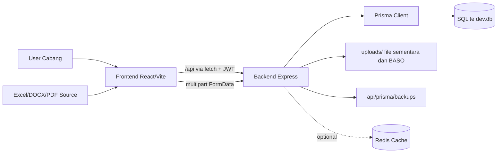
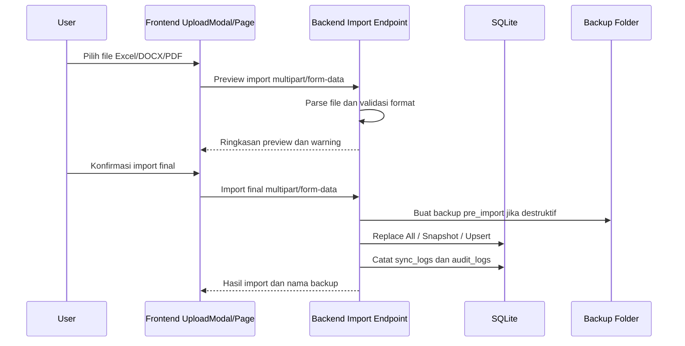
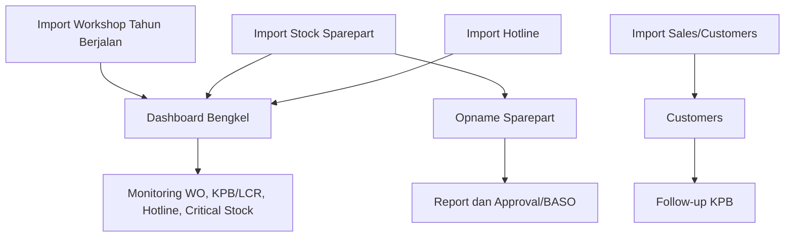
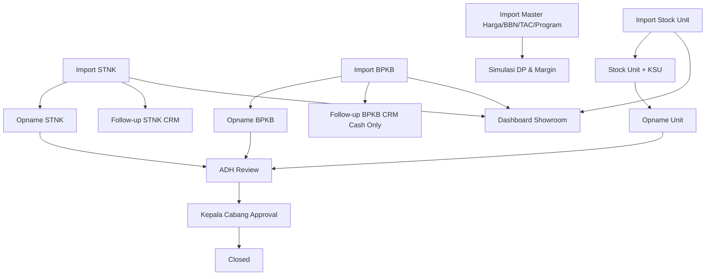

# BLUEPRINT.md
# Sistem Workshop, Sparepart, dan Showroom DXK

**Versi:** 1.0  
**Tanggal:** 6 Mei 2026  
**Status:** Functional, role-protected, dan siap dipakai harian untuk cabang DXK

---

## 1. Ringkasan Sistem

Sistem DXK adalah aplikasi operasional internal cabang TDM Ketapang/DXK untuk menggabungkan alur kerja bengkel, sparepart, showroom, dokumen kendaraan, follow-up pelanggan, stock opname, backup database, dan simulasi margin penjualan unit.

Tujuan utama sistem:

- Menyediakan dashboard harian untuk bengkel dan showroom.
- Mengolah data operasional dari Excel/DOCX hasil tarikan sistem induk.
- Mengurangi pekerjaan manual dalam monitoring WO, KPB, hotline part, stok, dokumen kendaraan, dan margin unit.
- Menjaga data follow-up tetap aman walaupun data sumber diimport ulang.
- Membatasi akses berdasarkan role cabang agar setiap user hanya melihat menu dan endpoint yang sesuai.
- Memberikan mekanisme backup/restore SQLite sebelum proses import destruktif.

---

## 2. Stack Aktual

| Layer | Teknologi |
|-------|-----------|
| Frontend | Vite + React 19 + Tailwind CSS v4 + React Router + Zustand + lucide-react |
| Backend | Node.js + Express 5 + Prisma |
| Database | SQLite file-based di `api/prisma/dev.db` |
| Auth | JWT 24 jam + bcryptjs |
| Upload | Multer + multipart/form-data |
| Excel | SheetJS `xlsx` |
| DOCX/PDF | Parsing dokumen harga/program, termasuk `textutil` untuk DOCX mentah di macOS |
| Barcode | jsbarcode CODE128 |
| Cache | Redis optional, graceful fallback ke database |

Sistem aktual tidak membutuhkan Docker untuk penggunaan lokal harian. `docker-compose.yml` masih ada tetapi tidak menjadi runtime utama karena database sudah memakai SQLite.

---

## 3. Arsitektur Tingkat Tinggi



Komponen utama:

- Frontend menjalankan route dan guard role di `web/src/App.jsx`.
- API client frontend tersentral di `web/src/services/api.js`.
- Backend mendaftarkan route domain di `api/src/app.js`.
- Authorization backend memakai middleware `authenticate` dan `authorize(...)`.
- Database schema didefinisikan di `api/prisma/schema.prisma`.
- Backup database berada di `api/prisma/backups`.

---

## 4. Modul Utama

| Domain | Fungsi Utama | Route Frontend | Endpoint Backend |
|--------|--------------|----------------|------------------|
| Auth | Login, data user aktif, JWT | `/login` | `/api/auth` |
| Dashboard Bengkel | KPI WO, revenue, hotline, stok, freshness | `/` | `/api/dashboard` |
| Workshop | List WO, summary, program KPB/LCR, performa mekanik | `/workshop`, `/monitor-kpb-lcr`, `/mechanics` | `/api/workshop` |
| Hotline Part | Monitoring hotline dan update state | `/hotline` | `/api/hotline` |
| Stock Sparepart | Monitoring stok, aging, ranking, barcode | `/stock` | `/api/stock` |
| Opname Sparepart | Scan barcode, selisih, approval, BASO | `/opname` | `/api/opname` |
| Customers & KPB | Data konsumen sales, status KPB, follow-up | `/customers`, `/follow-up-kpb` | `/api/customers` |
| Sync & Backup | Preview/import, logs, backup, restore, audit | `/backups` | `/api/sync` |
| User Management | CRUD user dan reset password | `/users` | `/api/users` |
| Dashboard Showroom | Ringkasan unit, aging, STNK, BPKB | `/showroom/dashboard` | `/api/showroom/dashboard` |
| Stock Unit | Snapshot unit aktif, aging, OTR, KSU | `/showroom/stock-unit` | `/api/showroom/stock-units` |
| STNK/BPKB | Stock dokumen mentah untuk Admin Showroom | `/showroom/stnk`, `/showroom/bpkb` | `/api/showroom/stnks`, `/api/showroom/bpkbs` |
| Follow-up Dokumen | Pipeline follow-up STNK/BPKB untuk CRM | `/follow-up-stnk`, `/follow-up-bpkb` | `/api/showroom/document-followups` |
| Master Harga | OTR, Off Road, Harga Beli Dealer | `/showroom/harga-otr` | `/api/showroom/otr-prices` |
| Master BBN | Internal BBN per product + area | `/showroom/bbn` | `/api/showroom/bbn-prices` |
| TAC/Promo/Program | Matrix TAC, Dana Promosi, Program MD/AHM/Dealer | `/showroom/tac-leasing`, `/showroom/program` | `/api/showroom/tac`, `/api/showroom/programs` |
| KSU | Master standar KSU dan pengecekan KSU unit | `/showroom/ksu` | `/api/showroom/ksu-standards`, `/stock-units/:engineNumber/ksu` |
| Simulasi DP & Margin | Kontrol DP net dan sisa margin showroom | `/showroom/sales-order-margin` | `/api/showroom/sales-order-margins` |
| Opname Showroom | Opname unit/STNK/BPKB dengan ADH dan Kacab | `/showroom/opname-*` | `/api/showroom/opname` |
| Notifications | Approval/opname notifications | Header/layout | `/api/notifications` |

---

## 5. Role dan Batas Akses

| Role Database | Label UI | Akses Utama |
|---------------|----------|-------------|
| `Admin` | Admin Showroom | Dashboard Showroom, Stock Unit, Master Harga, STNK, BPKB, Master BBN/TAC/Program, KSU, Simulasi DP & Margin |
| `PIC Stock opname` | PIC Stock opname | Operasi Opname Showroom Unit/STNK/BPKB |
| `ADH` | ADH | Verifikator tahap 1 Opname Showroom |
| `Kepala Cabang` | Kepala Cabang | Dashboard Bengkel, Dashboard Showroom, Stock Unit, Master Harga, hasil Opname Showroom, User, Backup & Restore |
| `Kepala Bengkel` | Kepala Bengkel | Semua modul bengkel/sparepart, user, backup/restore, performa mekanik |
| `Frondesk` | Frondesk | Dashboard Bengkel, Workshop, Follow-up KPB |
| `Service Advisor` | Service Advisor | Dashboard Bengkel, Hotline, Stock, Workshop, Program AHM, Customers, Follow-up KPB |
| `Partman` | Partman | Dashboard Bengkel, Stock, Hotline, Opname Sparepart |
| `CRM` | Admin CRM | Customers, Follow-up KPB, Follow-up STNK, Follow-up BPKB |

Default route setelah login:

- `Admin` diarahkan ke `/showroom/dashboard`.
- `CRM` diarahkan ke `/follow-up-kpb`.
- `ADH` dan `PIC Stock opname` diarahkan ke `/showroom/opname-unit`.
- Role bengkel diarahkan ke Dashboard Bengkel `/`.

Role guard diterapkan dua lapis:

- Frontend: `RoleGuard` dan sidebar menu.
- Backend: middleware `authenticate` dan `authorize(...)`, mengembalikan HTTP `403` jika role tidak sesuai.

---

## 6. Alur Data Import



Strategi import:

| Modul | Strategi | Key Penting |
|-------|----------|-------------|
| Workshop | Replace/snapshot tahun berjalan | `wo_number` |
| Stock Sparepart | Replace All + aggregation | `product_code` |
| Hotline | Replace All | `no_hotline` dan item detail |
| Sales/Customers | Upsert | `so_number` |
| Stock Unit Showroom | Snapshot aktif | `engine_number` |
| STNK Showroom | Snapshot aktif | `engine_number` |
| BPKB Showroom | Snapshot aktif | `engine_number` |
| Master Harga | Upsert | `product_code` |
| Master BBN | Upsert/import | `product_code + city_name` |
| Matrix TAC | Upsert | `leasing + series_key + dp_category + tenor + period_start` |
| Dana Promosi | Upsert | range OTR + DP percent + periode |
| Program MD/AHM/Dealer | Upsert | `product_code + sale_type + document_number + period_start` |

Catatan penting:

- Upload harus memakai `FormData` dan jangan memaksa `Content-Type: application/json`.
- Import destructive membuat backup SQLite otomatis.
- Upload stok sparepart menghapus sesi/item opname sparepart karena `qty_system` sudah tidak valid.
- Import Stock Unit/STNK/BPKB showroom diblokir jika ada sesi opname tipe terkait yang belum `closed`.

---

## 7. Workflow Operasional

### 7.1 Bengkel dan Sparepart



### 7.2 Showroom



---

## 8. Database dan Persistensi

Database utama:

```text
api/prisma/dev.db
```

Konfigurasi:

```env
DATABASE_URL=file:./dev.db
```

Karena Prisma SQLite path relatif terhadap folder `api/prisma`, konfigurasi tersebut menunjuk ke `api/prisma/dev.db`.

Kelompok tabel:

- Core auth dan audit: `users`, `sync_logs`, `audit_logs`.
- Bengkel/sparepart: `work_orders`, `stock_parts`, `hotlines`, `hotline_items`, `opname_sessions`, `opname_items`.
- Customers/follow-up: `customers`, `kpb_followups`.
- Showroom stock/dokumen: `showroom_stock_units`, `showroom_stnks`, `showroom_bpkbs`, `showroom_document_followups`.
- Master showroom: `showroom_otr_prices`, `showroom_bbn_prices`, `showroom_leasing_tac_programs`, `showroom_leasing_promo_schemes`, `showroom_md_programs`, `showroom_series_aliases`, `showroom_leasing_programs`.
- KSU: `showroom_ksu_standards`, `showroom_unit_ksu_checks`.
- Opname showroom: `showroom_opname_sessions`, `showroom_opname_items`.
- Margin showroom: `showroom_sales_order_margins`.

---

## 9. Backup, Restore, dan Audit

Backup SQLite tersimpan di:

```text
api/prisma/backups
```

Jenis backup:

- `pre_import_*`: dibuat otomatis sebelum import destruktif.
- `manual`: dibuat dari menu Backup & Restore.
- `pre_restore`: dibuat sebelum database aktif ditimpa oleh restore.

Aturan:

- Backup & Restore hanya untuk `Kepala Bengkel` dan `Kepala Cabang`.
- Cleanup hanya menghapus backup `pre_import_*` lama.
- Backup `manual` dan `pre_restore` tidak dihapus otomatis.
- Operasi import final, backup manual, dan restore dicatat ke `audit_logs`.

---

## 10. Prinsip Desain Sistem

- Data import dari sistem induk dianggap sebagai snapshot operasional, bukan sumber transaksi manual utama.
- Data follow-up disimpan di tabel terpisah agar tidak hilang saat import ulang.
- Role access dikunci di frontend dan backend.
- Preview import wajib sebelum import final dari UI.
- SQLite dipakai untuk operasional lokal sederhana dan mudah dibackup.
- UI internal memakai desain V2 Clean Corporate dengan toggle tema terang/gelap per browser.
- Kalkulator margin showroom tidak mengunci kebijakan margin karena kebijakan dapat berubah tiap bulan; sistem menampilkan sisa margin sebagai acuan keputusan.

---

## 11. Catatan Kondisi Aktual

- Sistem sudah fungsional dan siap dipakai harian.
- Frontend selalu memakai backend real; mock API sudah dihapus.
- Database aktif terakhir berisi puluhan ribu record, termasuk WO, customers, stock unit, STNK, BPKB, master harga, BBN, TAC, dan program.
- Source code sudah diinisialisasi git dan dibackup ke private GitHub repository menurut README.
- Beberapa area masih menjadi rencana perbaikan: JWT di localStorage, rate limiting, helmet, pemecahan controller besar, query performa, route config shared, pagination UI, dan potensi migrasi PostgreSQL jika concurrent users meningkat.
