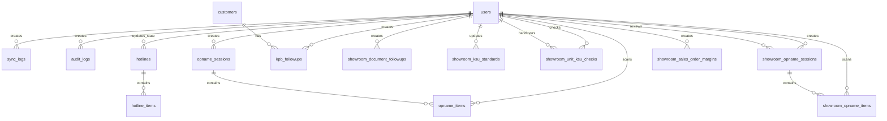
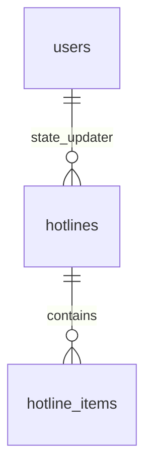

# ERD.md
# Entity Relationship Document - Sistem DXK

**Versi:** 1.0  
**Tanggal:** 6 Mei 2026  
**Sumber utama:** `api/prisma/schema.prisma`

---

## 1. Ringkasan Database

Database sistem memakai SQLite file-based melalui Prisma.

```text
api/prisma/dev.db
```

Konfigurasi Prisma:

```prisma
datasource db {
  provider = "sqlite"
  url      = env("DATABASE_URL")
}
```

Database berisi data operasional bengkel, sparepart, showroom, dokumen kendaraan, follow-up, user, audit, backup/import log, master harga, master BBN, TAC leasing, program sales, KSU, dan opname.

---

## 2. Kelompok Entitas

| Kelompok | Tabel |
|----------|-------|
| Core | `users`, `sync_logs`, `audit_logs`, `login_logs` |
| Workshop & Sparepart | `work_orders`, `stock_parts`, `hotlines`, `hotline_items` |
| Opname Sparepart | `opname_sessions`, `opname_items` |
| Customers & KPB | `customers`, `kpb_followups` |
| Showroom Stock & Dokumen | `showroom_stock_units`, `showroom_stnks`, `showroom_bpkbs`, `showroom_document_followups` |
| Master Showroom | `showroom_otr_prices`, `showroom_bbn_prices`, `showroom_leasing_programs`, `showroom_series_aliases`, `showroom_leasing_tac_programs`, `showroom_leasing_promo_schemes`, `showroom_md_programs` |
| KSU | `showroom_ksu_standards`, `showroom_unit_ksu_checks` |
| Opname Showroom | `showroom_opname_sessions`, `showroom_opname_items` |
| Margin Showroom | `showroom_sales_order_margins` |

---

## 3. ERD Utama



Catatan:

- Banyak tabel showroom tidak memakai foreign key langsung ke stock unit/dokumen karena data sumber berasal dari snapshot import dan dihubungkan secara logis menggunakan `engine_number`, `product_code`, `series_key`, atau `city_name`.
- `showroom_document_followups` memakai `document_type + engine_number` untuk menjaga riwayat follow-up tetap aman saat STNK/BPKB diimport ulang.
- `showroom_unit_ksu_checks` memakai `engine_number` sebagai unique logical key, tidak FK ke `showroom_stock_units`.

---

## 4. Detail Entitas Core

### 4.1 `users`

Menyimpan akun login dan role.

| Field | Tipe | Catatan |
|-------|------|---------|
| `id` | Int | PK autoincrement |
| `username` | String | Unique |
| `password_hash` | String | Hash bcrypt |
| `name` | String | Nama user |
| `role` | String | Role operasional (nilai pakai spasi, mis. `IT Master`) |
| `created_at` | DateTime | Default now |
| `session_id` | String? | Single-session: id sesi aktif (cocokkan dgn `sid` di JWT) |
| `session_last_active` | DateTime? | Waktu aktivitas terakhir (window 60 mnt utk anti-sharing) |

Relasi keluar:

- Membuat `sync_logs`, `audit_logs`, `login_logs`, `opname_sessions`, `kpb_followups`, `showroom_document_followups`, `showroom_opname_sessions`, dan `showroom_sales_order_margins`.
- Menjadi scanner/checker/reviewer pada opname dan KSU.

### 4.2 `sync_logs`

Mencatat riwayat import.

| Field | Catatan |
|-------|---------|
| `user_id` | Nullable FK ke `users` |
| `module` | Nama modul import |
| `filename` | Nama file sumber |
| `rows_success`, `rows_error` | Statistik hasil import |
| `error_detail` | Detail error opsional |
| `synced_at` | Waktu import |

### 4.3 `audit_logs`

Mencatat aktivitas perubahan tertentu, termasuk import final, backup manual, restore, dan aksi IT Master (`table_name = 'it_master_action'`).

| Field | Catatan |
|-------|---------|
| `table_name` | Nama tabel/domain |
| `record_id` | ID record atau nama objek |
| `field_name` | Field/aksi yang berubah |
| `old_value`, `new_value` | Nilai sebelum/sesudah |
| `user_id` | FK ke `users` |
| `changed_at` | Waktu audit |

### 4.4 `login_logs`

Audit login & deteksi penyalahgunaan akun (single-session). Ditampilkan di halaman `/security-audit` (IT Master).

| Field | Catatan |
|-------|---------|
| `user_id` | Nullable FK ke `users` (ON DELETE SET NULL) |
| `username` | Username saat kejadian |
| `event` | `login_success` \| `login_blocked` \| `logout` \| `session_reset` |
| `ip` | IP klien (X-Forwarded-For aware) |
| `user_agent` | Browser/perangkat |
| `created_at` | Waktu kejadian (indexed) |

---

## 5. Workshop dan Sparepart

### 5.1 `work_orders`

Snapshot Work Order bengkel tahun berjalan.

Key dan index:

- PK: `id`.
- Unique: `wo_number`.
- Index: `[state, date_confirm]`, `[mechanic, state]`, `[type, state]`.

Field penting:

| Area | Field |
|------|-------|
| Identitas WO | `wo_number`, `state`, `date_confirm`, `type` |
| Customer/unit | `customer_name`, `customer_mobile`, `engine_number`, `cassis_number`, `unit_name`, `no_polisi` |
| Program | `workshop_category`, `category_name`, `product_code`, `product_name` |
| Nilai transaksi | `quantity`, `het`, `discount`, `dpp`, `ppn`, `hpp`, `gp_total`, `total` |
| Metadata | `branch_code`, `branch_name`, `synced_at` |

Catatan: `cassis_number` adalah nama field aktual di schema walaupun secara bisnis berarti chassis number.

### 5.2 `stock_parts`

Data stok sparepart hasil aggregation by `product_code`.

Key dan index:

- PK: `id`.
- Unique: `product_code`.
- Index: `aging_days`.

Field penting:

- Identitas: `product_code`, `product_name`, `kategori`.
- Stock: `qty_available`, `total_stock_qty`, `total_stock_amt`, `harga_satuan`.
- Aging: `aging_raw`, `aging_days`, `movement_aging_raw`, `movement_aging_days`.
- Ranking dan lokasi: `ranking`, `lokasi`.

### 5.3 `hotlines` dan `hotline_items`

`hotlines` adalah header hotline part. `hotline_items` adalah detail part per hotline.

Relasi:



Key:

- `hotlines.no_hotline` unique.
- `hotline_items.hotline_id` FK cascade ke `hotlines.id`.

Field penting `hotlines`:

- `no_hotline`, `branch_code`, `tgl_hotline`, `customer`, `jenis_po`.
- `qty_hotline`, `qty_available`, `amount_hotline`, `qty_po`, `qty_wo`.
- `state`, `state_updated_at`, `state_updated_by`.

Field penting `hotline_items`:

- `product_code`, `description`, `price`, `qty_hotline`, `qty_po`, `qty_wo`.
- `no_po`, `tgl_po`, `umur_po`, `no_wo`, `tgl_wo`.

---

## 6. Opname Sparepart

### 6.1 `opname_sessions`

Header sesi stock opname sparepart.

| Field | Catatan |
|-------|---------|
| `session_name` | Nama/kode sesi |
| `pic_opname_name`, `workshop_head_name`, `branch_head_name` | Nama PIC/approval |
| `status` | Status workflow opname |
| `baso_signed_file` | File BASO signed jika ada |
| `created_by` | FK ke `users` |

### 6.2 `opname_items`

Item hasil scan opname sparepart.

Relasi:

- `session_id` FK cascade ke `opname_sessions.id`.
- `scanned_by` FK ke `users.id`.

Field penting:

- `product_code`, `product_name`.
- `qty_system`, `qty_physical`, `selisih`.
- `status`, `scanned_at`.

---

## 7. Customers dan KPB

### 7.1 `customers`

Data konsumen dari import sales/customer. Strategi import adalah upsert by `so_number` agar follow-up tidak hilang.

Key:

- PK: `id`.
- Unique: `so_number`.

Field penting:

| Area | Field |
|------|-------|
| Identitas | `customer_name`, `customer_mobile`, `no_ktp`, `alamat_konsumen`, `kecamatan`, `kabupaten`, `kelurahan` |
| Penjualan | `so_number`, `so_date`, `sales_type`, `payment_type`, `salesman`, `leasing`, `tenor` |
| Unit | `product_code`, `model`, `type`, `category`, `color`, `no_frame`, `no_engine` |
| Harga | `harga_otr`, `diskon`, `dp` |
| Metadata | `branch_code`, `state`, `synced_at` |

### 7.2 `kpb_followups`

Riwayat follow-up KPB konsumen.

Relasi:

- `customer_id` FK cascade ke `customers.id`.
- `created_by` FK ke `users.id`.

Index:

- `[customer_id, kpb_level, followup_at]`.
- `[status, followup_at]`.

Status bisnis:

- `belum_dihubungi`.
- `sudah_dihubungi`.
- `booking`.
- `datang`.
- `batal`.

---

## 8. Showroom Stock dan Dokumen

### 8.1 `showroom_stock_units`

Snapshot aktif stock unit showroom.

Key dan index:

- PK: `id`.
- Unique: `engine_number`.
- Index: `series`, `engine_state`, `stock_aging_days`.

Field penting:

- Identitas unit: `product_type`, `series`, `color`, `engine_number`, `chassis_number`, `year`.
- Stock: `location`, `engine_state`, `quantity`, `cost`, `freight_cost`.
- Aging: `incoming_date`, `stock_aging_raw`, `stock_aging_days`, `movement_aging_raw`, `movement_aging_days`.
- Mutasi: `last_movement`, `last_transaction`, `branch_destination`, `incoming_date_mutation`.

### 8.2 `showroom_stnks`

Snapshot aktif stock dokumen STNK.

Key dan index:

- Unique: `engine_number`.
- Index: `stnk_location`, `stnk_ready_date`, `stnk_expired_date`, `age_raw`.

Field penting:

- `stnk_name`, `customer_code`, `customer_address`, `sale_order_number`.
- `receipt_number`, `receipt_date`, `stnk_location`.
- `engine_number`, `stnk_ready_date`, `stnk_expired_date`, `police_number`.
- `mobile`, `applicant_name`, `salesman`, `finance_company`.

### 8.3 `showroom_bpkbs`

Snapshot aktif stock dokumen BPKB.

Key dan index:

- Unique: `engine_number`.
- Index: `bpkb_location`, `bpkb_ready_date`, `overdue_days`.

Field penting:

- `stnk_name`, `applicant_name`, `customer_address`, `receipt_number`.
- `bpkb_location`, `engine_number`, `bpkb_number`, `bpkb_ready_date`.
- `finance_company`, `invoice_number`, `customer_phone`, `salesman`, `requestor_name`.
- `overdue_days`.

### 8.4 `showroom_document_followups`

Riwayat follow-up STNK/BPKB untuk Admin CRM.

Key dan index:

- Index: `[document_type, engine_number, followup_at]`.
- Index: `[document_type, status, followup_at]`.

Field penting:

- `document_type`: `stnk` atau `bpkb`.
- `engine_number`: logical key ke dokumen showroom.
- `status`: status follow-up.
- `note`, `followup_at`, `created_by`.

Status bisnis:

- `belum_dihubungi`.
- `sudah_dihubungi`.
- `diambil`.
- `pending`.
- `batal`.

---

## 9. Master Data Showroom

### 9.1 `showroom_otr_prices`

Master harga OTR, Off Road, dan Harga Beli Dealer.

Key:

- Unique: `product_code`.
- Index: `model_name`, `effective_date`.

Field penting:

- `product_code`, `description`, `model_name`.
- `otr_price`, `off_road_price`, `dealer_purchase_price`.
- `source_file`, `source_file_off_purchase`, `synced_at`.

### 9.2 `showroom_bbn_prices`

Master BBN internal per kode produk dan area.

Key:

- Unique composite: `[product_code, city_name]`.
- Index: `product_code`, `city_name`.

Field penting:

- `product_code`, `city_code`, `city_name`.
- `notice`, `pnbp_stck`, `jasa`, `jasa_area`, `fee_pusat`, `total`.
- `fee_pusat` dipakai sebagai biaya tambahan BBN untuk menyamakan internal BBN Odoo.

### 9.3 `showroom_series_aliases`

Alias keyword product/series ke `series_key` untuk pencarian TAC.

Key:

- Unique: `keyword`.
- Index: `series_key`, `priority`.

Field penting:

- `keyword`, `series_key`, `priority`, `is_active`.

### 9.4 `showroom_leasing_tac_programs`

Matrix TAC/PS Finco leasing ADIRA/FIF/OTO.

Key:

- Unique composite: `[leasing, series_key, dp_category, tenor, period_start]`.
- Index: `[leasing, series_key]`, `[period_start, period_end]`.

Field penting:

- `leasing`, `series_key`, `dp_category`, `tenor`, `amount`.
- `period_start`, `period_end`, `is_active`, `source_file`.

### 9.5 `showroom_leasing_promo_schemes`

Dana Promosi Scheme, dipakai terutama untuk IMFI berbasis range OTR.

Key:

- Unique composite: `[leasing, otr_min, otr_max, tenor, dp_min_percent, dp_max_percent, period_start]`.

Field penting:

- `leasing`, `scheme_name`, `otr_min`, `otr_max`, `tenor`.
- `dp_min_percent`, `dp_max_percent`.
- `gross_amount`, `branch_deposit_amount`, `amount`.
- `period_start`, `period_end`, `is_active`.

### 9.6 `showroom_md_programs`

Master Program MD/AHM/Dealer untuk simulasi margin.

Key:

- Unique composite: `[product_code, sale_type, document_number, period_start]`.
- Index: `product_code`, `sale_type`, `[period_start, period_end]`.

Field penting:

- `product_code`, `sale_type`.
- `ahm_discount`, `md_discount`, `dealer_discount`, `total_discount`.
- `area`, `program_name`, `document_number`.
- `period_start`, `period_end`, `is_active`.

### 9.7 `showroom_leasing_programs`

Model lama/pendukung untuk leasing subsidy by product, tenor, leasing.

Key:

- Unique composite: `[product_code, tenor, leasing]`.

Field penting:

- `product_code`, `series`, `tenor`, `leasing`, `finco_subsidy`.

---

## 10. KSU

### 10.1 `showroom_ksu_standards`

Master standar kelengkapan unit per `product_type`.

Key:

- Unique: `product_type`.
- Index: `series`, `standard_battery_type`.

Field penting:

- `helmet_required`, `service_book_required`, `tool_kit_required`, `mirror_required`, `battery_required`.
- `standard_battery_type`, `is_verified`, `notes`, `updated_by`.

### 10.2 `showroom_unit_ksu_checks`

Status KSU aktual per unit berdasarkan `engine_number`.

Key:

- Unique: `engine_number`.
- Index: `status`, `actual_battery_type`.

Field penting:

- `has_helmet`, `has_service_book`, `has_tool_kit`, `has_mirror`, `has_battery`.
- `actual_battery_type`, `status`, `notes`.
- `checked_by`, `checked_at`, `handed_over_by`, `handed_over_at`.

---

## 11. Opname Showroom

### 11.1 `showroom_opname_sessions`

Header sesi opname showroom untuk unit, STNK, atau BPKB.

Key dan index:

- Unique: `session_code`.
- Index: `[opname_type, status]`, `created_at`.

Field workflow:

- `opname_type`: tipe opname, misalnya unit/STNK/BPKB.
- `status`: `draft`, `open`, `submitted`, `adh_done`, `rfa`, `approved`, `rejected`, `closed`.
- Nama penanggung jawab: `pic_so_name`, `adh_name`, `branch_head_name`.
- Approval metadata: `reviewed_by`, `adh_approved_by`, `kacab_approved_by`.
- Timestamp: `confirmed_at`, `submitted_at`, `adh_approved_at`, `sent_to_kacab_at`, `approved_at`, `closed_at`, dan field workflow lain.
- BASO: `baso_signed_file`, `baso_printed_at`, `baso_uploaded_at`, `baso_verified_at`.

### 11.2 `showroom_opname_items`

Item opname showroom.

Key dan index:

- Unique composite: `[session_id, reference_key]`.
- Index: `[session_id, status]`, `reference_key`.

Field penting:

- `reference_key`: nomor mesin atau nomor dokumen utama.
- `secondary_key`: nomor pendukung seperti chassis/dokumen.
- `display_name`, `system_location`, `physical_location`.
- `status`, `scanned_at`, `scanned_by`, `notes`.

---

## 12. Sales Order Margin

### 12.1 `showroom_sales_order_margins`

Menyimpan hasil simulasi/sales order margin showroom.

Key dan index:

- Unique: `so_number`.
- Index: `so_date`, `engine_number`, `margin_status`.

Field utama:

| Area | Field |
|------|-------|
| SO dan customer | `so_number`, `so_date`, `customer_name`, `customer_phone`, `customer_address`, `salesman` |
| Pembayaran | `payment_type`, `finance_company`, `tenor`, `down_payment` |
| Unit | `engine_number`, `chassis_number`, `product_type`, `series`, `color`, `year`, `location` |
| Harga dan diskon | `otr_price`, `purchase_price`, `deal_price`, `customer_discount`, `dealer_subsidy`, `leasing_subsidy`, `cashback` |
| Beban | `sales_commission`, `mediator_commission`, `accessory_cost`, `gift_cost`, `other_cost` |
| Margin | `margin_initial`, `total_deduction`, `margin_remaining`, `margin_percent`, `margin_status` |
| Metadata | `notes`, `status`, `created_by`, `created_at`, `updated_at` |

Catatan: kalkulator preview saat ini memakai master harga, BBN, TAC, promo scheme, dan program MD/AHM/Dealer untuk menghasilkan simulasi margin operasional.

---

## 13. Key Constraint dan Strategi Data

| Tabel | Constraint Penting | Alasan Bisnis |
|-------|--------------------|---------------|
| `users` | `username` unique | Satu username untuk login |
| `work_orders` | `wo_number` unique | Dedup WO saat import |
| `stock_parts` | `product_code` unique | Stok diagregasi per produk |
| `hotlines` | `no_hotline` unique | Header hotline unik |
| `customers` | `so_number` unique | Upsert sales/customer tanpa menghapus follow-up |
| `showroom_stock_units` | `engine_number` unique | Snapshot unit aktif per nomor mesin |
| `showroom_stnks` | `engine_number` unique | Satu STNK aktif per nomor mesin |
| `showroom_bpkbs` | `engine_number` unique | Satu BPKB aktif per nomor mesin |
| `showroom_otr_prices` | `product_code` unique | Master harga per kode produk |
| `showroom_bbn_prices` | `product_code + city_name` unique | Master BBN per kode produk dan area |
| `showroom_leasing_tac_programs` | `leasing + series_key + dp_category + tenor + period_start` unique | Matrix TAC per periode |
| `showroom_md_programs` | `product_code + sale_type + document_number + period_start` unique | Program diskon per dokumen/periode |
| `showroom_ksu_standards` | `product_type` unique | Standar KSU per tipe unit |
| `showroom_unit_ksu_checks` | `engine_number` unique | Status KSU per unit |
| `showroom_opname_sessions` | `session_code` unique | Kode opname unik |
| `showroom_opname_items` | `session_id + reference_key` unique | Satu item per sesi opname |
| `showroom_sales_order_margins` | `so_number` unique | Satu simulasi/simpan per nomor SO |

---

## 14. Catatan Desain Relasi

- Relasi eksplisit Prisma dipakai terutama untuk user ownership, detail header-item, dan follow-up customer.
- Banyak relasi showroom dibuat longgar menggunakan key bisnis karena data berasal dari file snapshot yang dapat berubah saat import ulang.
- Follow-up KPB memakai FK ke `customers` karena `customers` tidak dihapus saat import ulang, hanya upsert.
- Follow-up STNK/BPKB tidak FK ke tabel dokumen agar riwayat tetap aman walaupun dokumen keluar dari snapshot aktif.
- KSU per unit memakai `engine_number` unique agar tetap bisa dipertahankan sebagai status operasional unit.
- SQLite tidak memakai enum di schema; role/status/state disimpan sebagai String dan dikontrol oleh aplikasi.
